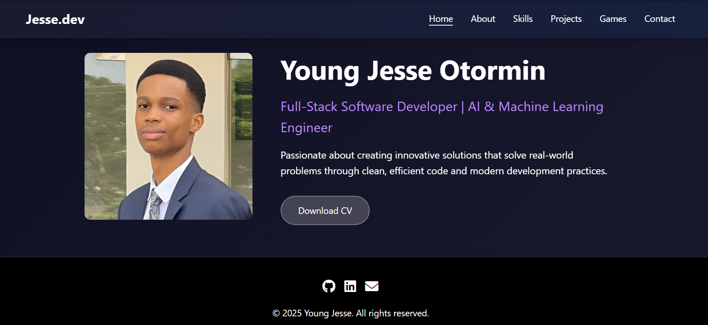
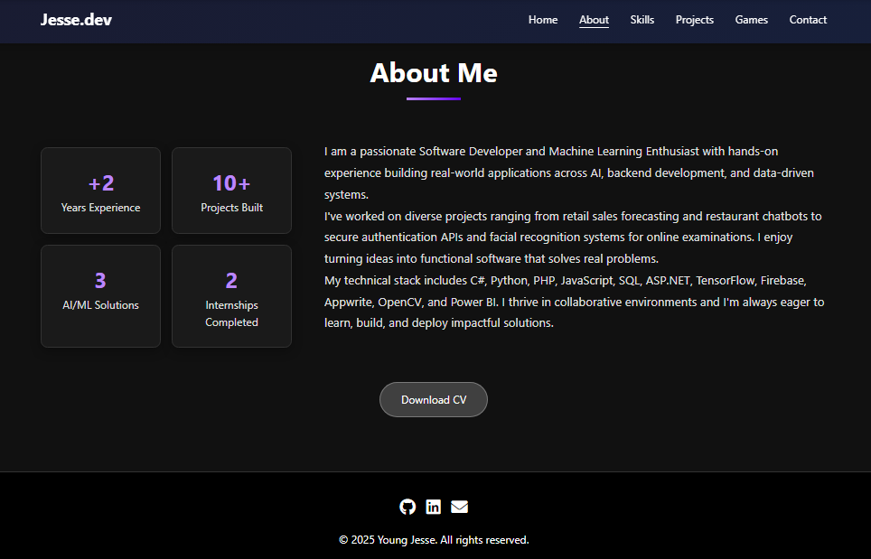
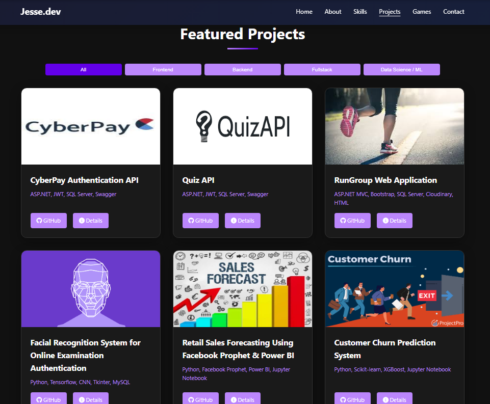
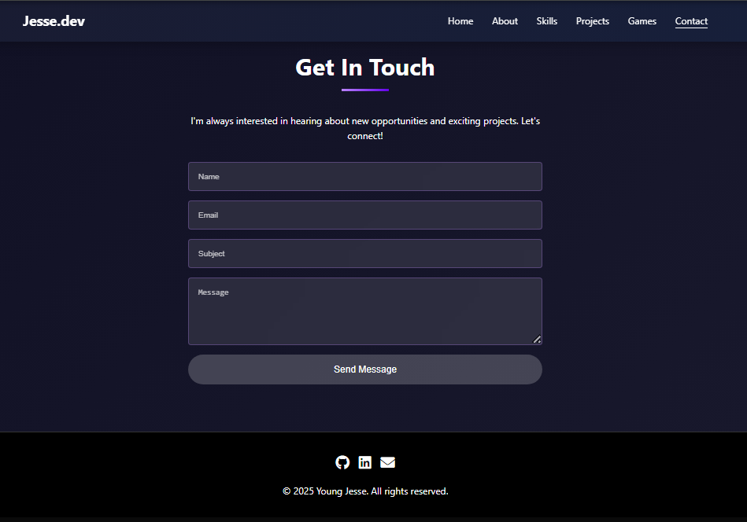
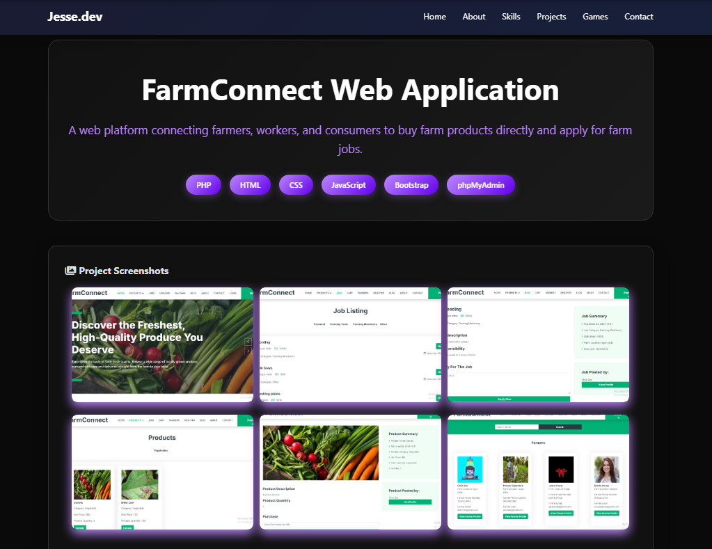

---

# 👨‍💻 Jesse's Portfolio

**A central hub showcasing my journey as a Software Developer, featuring a diverse range of projects in Full Stack Web Development, Machine Learning, and Cloud Computing.**

## 📖 About The Project

This repository hosts the source code for my personal portfolio website. It serves as a comprehensive catalog of my technical skills, demonstrating my ability to build everything from complex backend APIs and machine learning models to interactive JavaScript games and frontend interfaces.

I built this portfolio to be:

* **Clean & Professional:** A minimalist design that puts the code first.
* **Responsive:** Fully optimized for mobile, tablet, and desktop viewing.
* **Interactive:** Providing direct links to live demos and code repositories.

## 📸 Screenshots

## 🤝 Contact

I am open to job opportunities and freelance projects. Feel free to reach out!

* **Name:** Young Jesse
* **Email:** yjesse507@gmail.com
* **LinkedIn:** [https://www.linkedin.com/in/jesse-young-62b01124b?utm_source=share&utm_campaign=share_via&utm_content=profile&utm_medium=android_app]
* **GitHub:** [https://github.com/Otormin](https://www.google.com/search?q=https://github.com/Otormin)

---

*© 2025 Jesse. All Rights Reserved.*